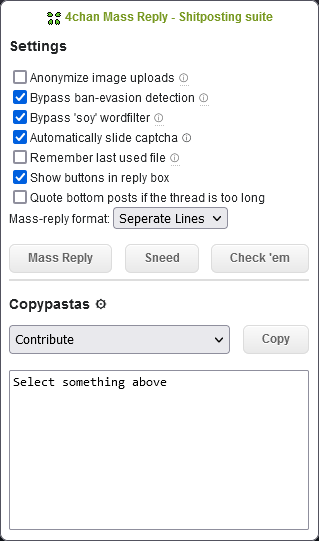
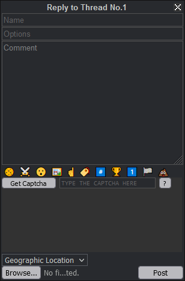

# 4chan Mass Reply browser extension


Inspired by /tv/'s posting culture, this browser extension aims to facilitate the creation of mass replies on 4chan.org and 4channel.org.

## Features:

- Anonymize image uploads by randomizing hash and filename
- Redditify image uploads
- Bypass ban evasion detection by stripping the 4chan_pass cookie and randomizing numbers of the user-agent
- Bypass common wordfilters by replacing a letter in the filtered words with a similar letter
- Automatically slide captcha it into the right position
- Reattach the last selected file
- Configurable mass reply with multiple targets
- Soyquote text and filename



## Usage
Use the buttons in the reply box for (left to right):
- Delete 4chan_pass cookie
- Reply to every post on the page
- Convert quotelinks into soyquotes (for example: `>>123456` in the comment field will be replaced with the quoted content of that post without a link to it)
- Convert quotelinks into filename quotes
- Reply to posts with repeating digits in the post number
- Anonymize file name
- Anonymize file hash
- Rank IDs by their post count
- Reply to 1-post-by-this-ID
- Reply to /pol/ memeflag posts
- Quote knowyourmeme.com filenames




## Permissions:
- Storage to save the settings between each use
- Access to 4chan and 4channel

## Install
### Firefox
- https://github.com/HamletDuFromage/4chan-mass-reply/releases/latest/download/4chan_mass_reply.xpi

### MS Edge
- https://microsoftedge.microsoft.com/addons/detail/4chan-mass-reply/objbncahkeohdginhdcifhfchmhpoggg

### Chrome/Chromium/Brave
- Download `4chan-mass-reply-unpacked.zip` from the Releases section and sideload it.

### Android
- With [Kiwi Browser](https://kiwibrowser.com/) (WebView), download `4chan-mass-reply-unpacked.zip` from Releases section and install the extension via ( ⋮ ) -> Extensions.
- With [SmartCookieWeb Preview](https://github.com/CookieJarApps/SmartCookieWeb-Preview/releases/latest) (GeckoView), go to `about:config`, set `xpinstall.signatures.required` to `false`, download `
4chan_mass_reply.xpi ` from Releases section and sideload the extension via Advanced settings -> Sideload XPI.

## How to build
```
$ npm install --save-dev
$ npm run build
```
The resulting extension will be in `dist/`.

### Buy me a coffee?
https://ko-fi.com/hamletdufromage
